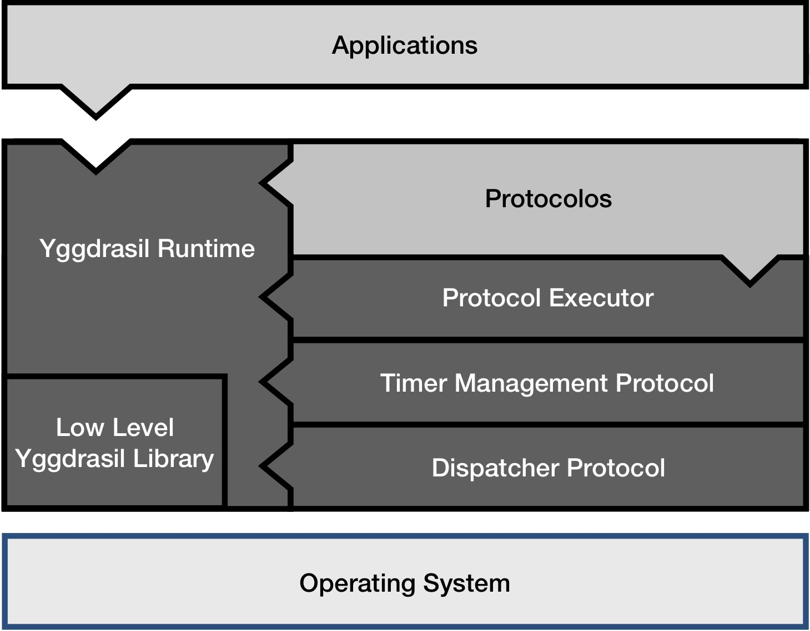

# Yggdrasil
Yggdrasil Public Repository (Version 2)

Yggdrasil is a framework and runtime system for distributed protocols.

Initially, Yggdrasil was tailored for wireless ad hoc networks, but has since grown to incorporate primitives and abstractions for traditional wired IP networks.

## Yggdrasil Architecture

<!--  -->

The figure above depicts a high level overview of the Yggdrasil Framework.

Yggdrasil operates above the operating systems, and provides abstractions that applications and distributed protocols can leverage.

This abstractions are provided by the "darker" tone components in the figure:

* **Low Level Yggdrasil Library:** This library provides low level device configuration to Yggdrasil. This component was built to be responsible for the configuration of radio device, and to expose a *channel* abstraction through where network communication is possible. 
* **Yggdrasil Runtime:** This is the main component of Yggdrasil. It is responsible to manage the life-cycle and operation of the protocols operating alongside an application.
* **Dispatcher Protocol:** This protocol is used to send and receive messages directly to/from the network.
* **Timer Management Protocol:** This protocol is responsible to manage all time-sensitive actions within an application.
* **Protocol Executor:** This component allows protocols to execute in a single-shared execution thread.

### Protocols & Applications in Yggdrasil

In Yggdrasil protocols and applications are modelled as state machines. 
Each protocol and application contains an internal state that evolves (or is exposed) by the processing of events.

A process can contain multiple protocols that work in cooperation to provide a variety of abstractions/services to an application.

Yggdrasil Supports 4 types of events:
* *Messages* - Network Messages between the same protocol in different processes.
* *Timers* - Report the passage of time to perform actions.
* *Notifications* - Interactions between 1:N protocols in a single process.
* *Requests/Replies* - Interactions between 1:1 protocols in a single process.

The usage of these events in further detailed [here](Yggdrasil/).

## Project Structure

The Yggdrasil Project is structured in such way that divides code relevant for ip and wireless networks.
This allows the compilation of only the parts relevant for your binary or library.

* Yggdrasil-LowLevelLib :
    * `src` - contains common features for both wireless and ip networks.
    * `src_ip` - contains features only related to ip networks.
    * `src_wireless` - contains features only related to wireless networks.
* Yggdrasil :
    * `core` - contains the Yggdrasil code for supporting the development and execution of protocols and applications.
    * `applications` - contains demo and test applications running atop Yggdrasil.
    * `protocols` - contains protocols developed using Yggdrasil abstractions.
    * `remote_control` - contains an application for remote experience management.

## Project Dependencies

The project present the following dependencies:

* libnl3 - `sudo apt install libnl-3-dev` - This is used to configure the radio devices for applications operating in wireless ad hoc networks; (applications that only operate over traditional ip networks do not require this).
* uuid - `sudo apt install uuid-dev` - This is used throughout the whole project to easily identify elements uniquely.

This is a cmake project. You will need cmake to build:
* cmake - `sudo apt install cmake`

